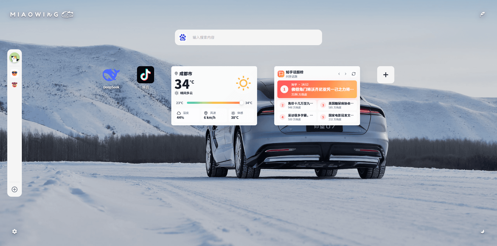
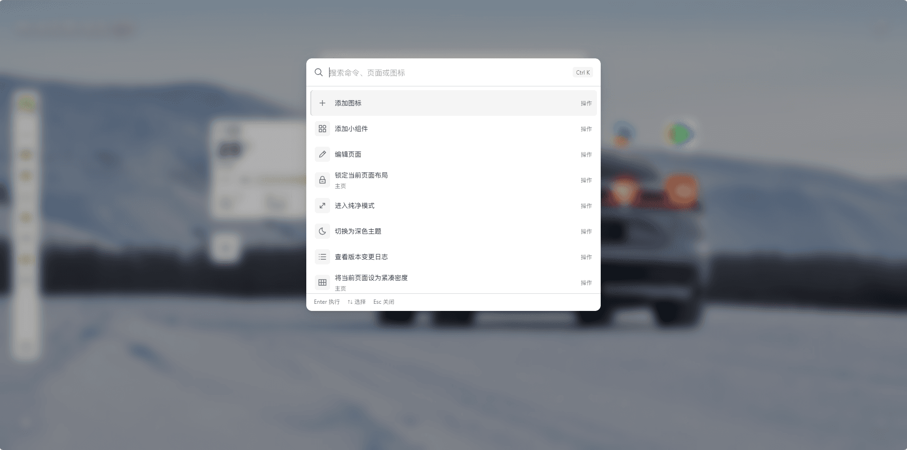
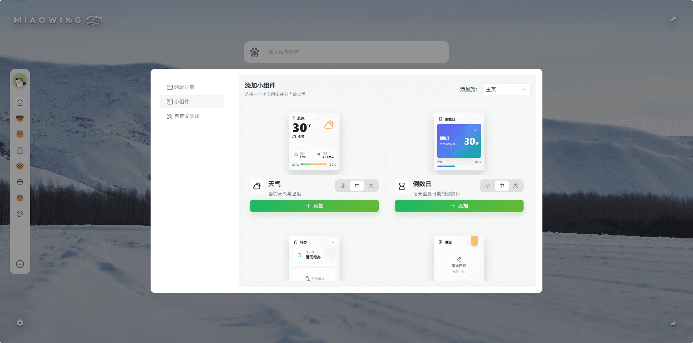
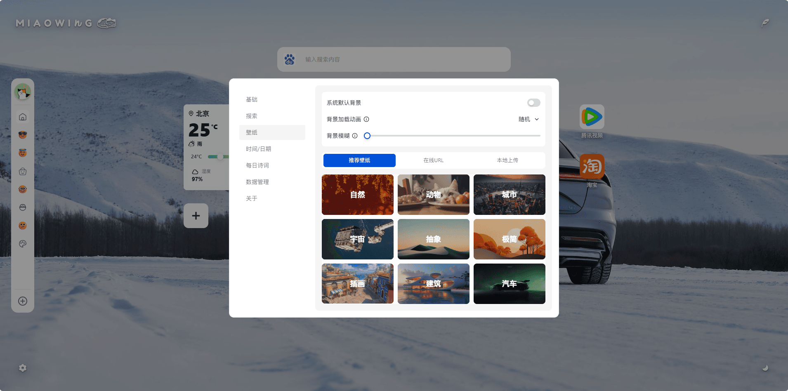
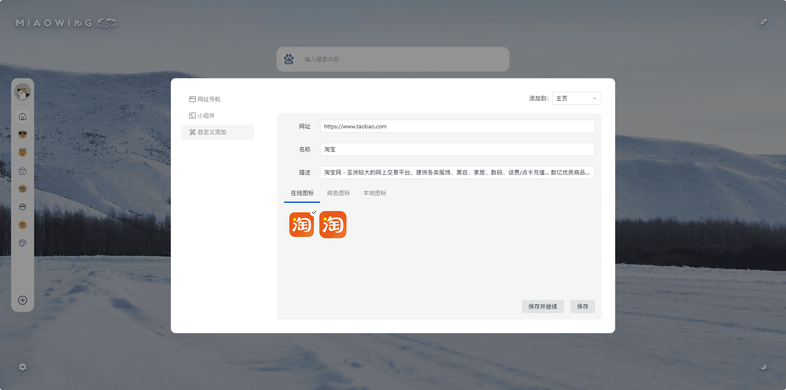
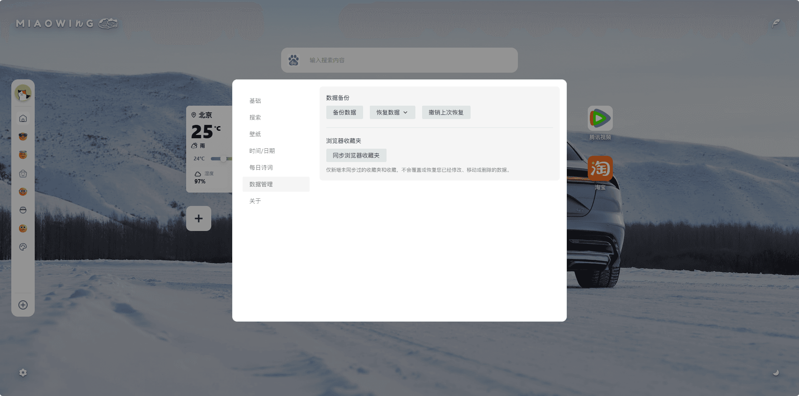

# 喵 ing Tab 1.0.0 正式发布

## 写在前面

感谢您愿意把 `喵ing Tab` 放在每天都会打开的新标签页里。

## 每天打开的第一屏

桌面是 `喵ing Tab` 的中心，除了固定的搜索框以外，目前支持放置三种内容：图标（网址导航）、文件夹以及小组件，侧边栏可以将窗口划分多个页面，就像手机的多个屏幕一样，滚动鼠标滚轮或点击侧边栏页面图标即可切换桌面。如果通过右上角羽毛图标将桌面切换为纯净模式，那么桌面将只保留最基础的搜索框以及可以由您在设置中控制是否显示的时间日期及每日诗词。

文件夹是图标的集合，同一个桌面下的多个图标可以通过拖拽的方式将它们合并成文件夹，文件夹支持在大/小两种形态之间切换。

桌面显示密度支持紧凑、标准和宽松三种形态：紧凑适合想放更多内容的屏幕，宽松适合更舒展的桌面，标准则保持日常使用的平衡。显示密度是按页面生效的，这意味着不同的页面可以有不同的显示密度，在设置中您可以通过设置 `默认显示密度` 来控制页面新增时的默认显示密度。

桌面可能同时放置图标（网址导航）、文件夹以及小组件，但它们的尺寸并不一致，所以在设置中（基础）提供了`图标、小组件排列方式`配置，您可以选择喜欢的排列方式（按顺序排列/紧凑填充）。

编辑页面功能可以让所有桌面内容（图标/文件夹/小组件）进入待删除状态，点击内容左上角的删除图标即可将内容从桌面移除，桌面的每一项内容也支持右键直接删除。

图标（网址导航）、文件夹以及小组件右键点击时会有各自的操作菜单，但也有一些菜单是共有的，除了上面提到的 `删除` 操作以外，还有 `移动到页面` 和 `编辑页面` 两项共有操作。

`移动到页面` 操作类似在手机桌面上移动 `APP/组件` 所在的屏幕，对于桌面上存在的内容，您可以右键点击，选择移动到页面，再选择目标页面即可完成移动，第二种方式是通过拖拽内容到侧边栏目标页面的图标上停留来完成移动，除了这两种方式以外，拖拽内容到屏幕的顶/底边缘停留也可以直接移动到相邻页面。

如果您已经有一套熟悉的桌面布局和排列，可以通过右键操作或者命令面板锁定布局，锁定布局仅针对单一页面生效，这样您就可以拥有一个不会被误操作不小心破坏掉的页面。

## 搜索和命令更适合高频操作

搜索框是打开新标签页后最自然的起点，您可以选择搜索引擎，开启搜索建议和搜索历史，设置结果在当前标签页或新标签页打开，也可以用 `Tab` 键快速切换搜索引擎。将鼠标放置在搜索历史栏目上，会同时浮现书签和删除图标，点击书签图标可以将其添加到常用搜索项。

命令面板是在 `0.0.10` 版本首次实现的，它负责处理更快的插件内操作，通过快捷键 `Ctrl + K` 或鼠标右键点击桌面选择操作来打开。命令面板支持搜索命令、切换页面、打开桌面图标、添加图标或小组件、编辑页面、锁定布局、切换主题、调整显示密度、切换桌面/纯净模式、查看版本变更日志以及同步浏览器收藏夹等操作，命令面板的引入使得绝大部分的常用操作可以通过键盘完成，而无需鼠标的参与。

## 小组件成为桌面里的小应用

小组件不再只是摆在桌面上的卡片，而是可以长期停留在桌面里的小应用，`1.0.0` 版本总共包含天气、倒数日、待办、便签、日历、番茄钟、世界时钟、常用站点和热榜九个小组件，后续会持续优化它们并新增更多的小组件。

## 壁纸、主题

壁纸中心可以管理桌面所使用的背景，目前存在两种模式，一种为系统背景，浅色主题和深色主题对应不同的主题背景色；二为设置图片/壁纸背景，当前支持推荐壁纸、在线 URL 和 本地上传三种方式来设置。

推荐壁纸当在 `1.0.0` 版本首次发布时仅包含9种分类共25张图片，后续会静默更新。

`1.0.0` 版本重新梳理了主题体系，整体视觉风格会更加统一。

## 添加内容更自由，数据也更安心

添加入口分为网址导航、小组件和自定义添加，自定义添加现在除了自动获取图标以外，还支持自动获取网站名称以及描述，同时自动获取图标的能力也得到了大幅增强。

数据备份现在支持手动备份当前数据、恢复备份（覆盖/合并）数据以及撤销上次恢复，恢复备份前，可以先预览将要恢复的分类、图标、文件夹、小组件、缓存文件和搜索历史，再决定是否确认操作，同时即使您在没有完全确认的情况下误操作了确认恢复，您也可以通过撤销上次恢复来取消这一次的恢复备份操作，回退到恢复备份之前的状态。

同步浏览器收藏夹同样会先预览，它只会新增还没有同步过的分类和收藏，不会覆盖您已经移动、删除或手动修改过的桌面内容。

## 写在最后

`喵ing Tab 0.0.1` 版本代码完成记录于 `2024 年 12 月 16 日`，但真正开始开发实际上还要早于这个时间点。原本这只是一次被动的尝试，为了在技术之外探索一些其他的可能性，但因为可投入时间和精力零碎有限，所以进展一直缓慢，直到 `2025 年 4 月` 底才完成了真正意义上的`0.0.1`版本，但这只是从功能层面而言，实际上当时的版本一直没有正式发布到 `Edge` 的扩展商店。

`2025` 年的春节，`DeepSeek` 掀起了一场 `AI` 革命，它让 `AI` 像水、电和网络一样触手可及，此后国内外第二梯队的大模型加速进化，让 `AI` 改变世界的进程有了飞速的推进。

`2025` 年，`AI` 的发展日新月异，`AI Coding` 的能力也越来越强，如果说在 `2025` 年年中的时候，`AI Coding` 可能还只是一个执行力很强、知识面很广的实习员工，但是到了 `2025` 年底，`AI Coding` 已经可以完全替代初级，甚至一部分中级工程师了。

得益于 `AI Coding` 的快速发展，从 `2026` 年初，我原本投入时间和精力有限的 `喵ing Tab` 进入了加速迭代的进程。

`0.0.3` 版本之前，所有的代码都由我一行一行编写，而在 `0.0.3` 版本之后，我没有再写过一行代码，所有后续版本内容都是我通过`AI Coding` 实现。

得益于初期的规范建设，在 `AI Coding` 后续的迭代过程中，我并没有再添加任何约束，但项目的整体架构到如今依旧稳定，甚至可以说 `喵ing Tab` 如今已经是一个小的“桌面系统”了。

`喵ing Tab` 延续了 `0.0.1` 版本之初的设计，到今天，它依旧是一个纯粹的桌面系统，所有数据都由您自行管理，这句话的含义是——您的所有数据和操作都不会被记录到云端或者任何其他第三方服务之上，它只会保留在您自己的浏览器中，或者由您手动备份数据到电脑本地。`喵ing Tab`提供的搜索建议、推荐壁纸、每日诗词、天气信息（天气小组件）、热搜榜单信息（热搜小组件）也都只是单向的信息获取。

今天，`喵ing Tab 1.0.0` 正式发布，希望它能把新标签页变成一个您可以真正长期使用的个人桌面。
